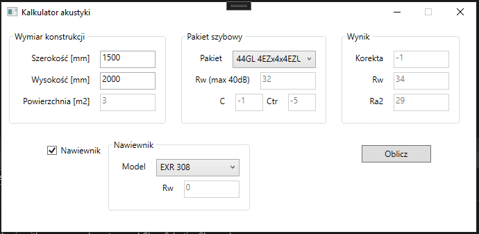

# AcousticCalculator

Simple window acoustics calculator for window dealers.

## Table of contents
* [General info](#general-info)
* [Technologies](#technologies)
* [Setup](#setup)

## General info

This calculator is compliant 
with the PN-EN 14351-1:2006 standard 
and helps to quickly count the acoustic 
properties of the standard windows with and without air inlets.
Parameters of glass units and inlets are taken from company MSSQL database.

## Technologies

.NET Core 3.1   
Entity Framework Core 3.1   
WPF

## Setup

Build the project in Visual Studio
